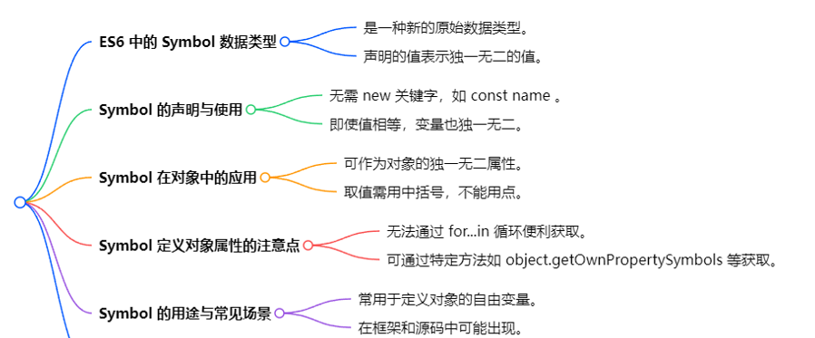
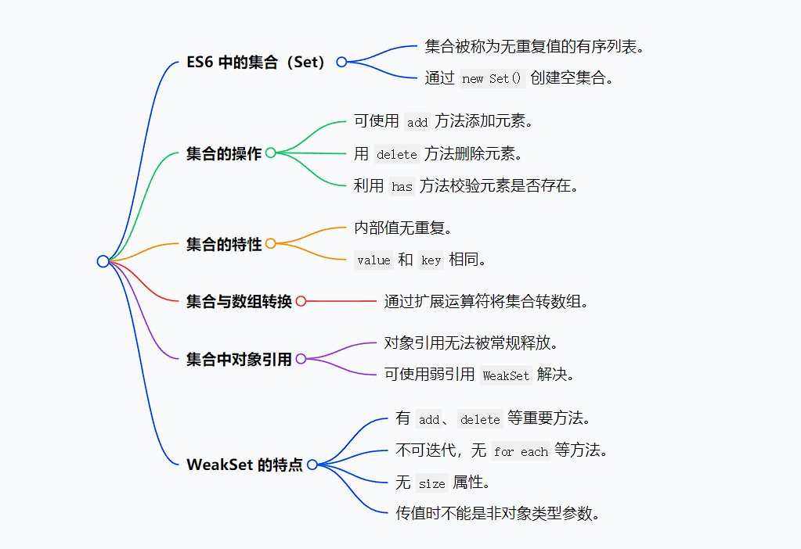
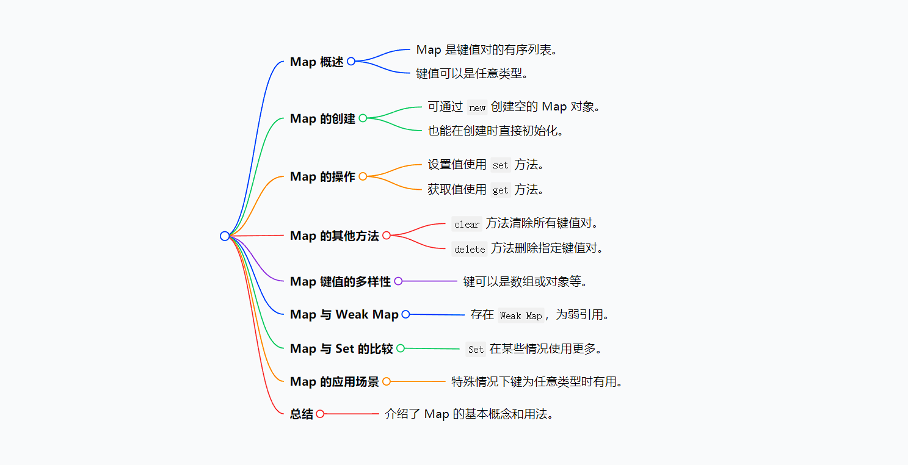

---
sidebar:
  title: es6+
isTimeLine: true
title: es6
tags:
  - 技术笔记
categories:
  - 技术笔记
recommend: 13
---

# e6

> ECMAScript 6.0（以下简称 ES6）是 JavaScript 语言的下一代标准，已经在 2015 年 6 月正式发布了。它的目标，是使得 JavaScript 语言可以用来编写复杂的大型应用程序，成为企业级开发语言。
> 90%的浏览器都支持 ES6，也可以通过 babel 编译器（一个 js 编译器）将 ES5 代码 转为 ES6 代码

## 1. let 和 const

::: tip :100:

- let 声明变量没有变量提升，var 有变量提升
- let 是一个块作用域，let 声明的变量只在它所在的代码块有效。
- let 不可以重复声明 ，var 可以重复
- const 声明常量，一旦声明就不能被修改，除此之外也有 let 的三个特性。
  :::

  ### let 基本用法-块级作用域

  ```js
  {
    let a = 10
    var b = 20
  }
  console.log(a) //a is not defined
  console.log(b) //20
  ```

### 不存在变量提升

`var` 命令会发生变量提升现象，即变量可以在声明之前使用，值为 undefined。按照一般的逻辑，变量应该在声明语句之后才可以使用。

```js
//var的情况
console.log(c) //输出undefined
var name = zjy

//let的情况
console.log(name) // 报错ReferenceError
let name = 30
```

### 不允许重复声明

```js
let c = 10
let c = 30
console.log(c) //报错

function func(arg) {
  let arg // 报错
}
```

### 块级作用域

```js
{
  let a = 10
}
console.log(a) //报错

if (true) {
  let a = 10
}
console.log(a) //报错

const arr = []
for (let i = 0; i < 10; i++) {
  arr[i] = function () {
    return i
  }
}

console.log(arr[5]()) //5  如果let i  换 var i  那么结果不一样了
```

### const 基本用法-声明只读的常量

> `const` 一旦声明变量，就必须立即初始化，不能留到以后赋值。对于 `const` 来说，只声明不赋值，就会报错

```js
const a = 10;
a = 20; //报错

const b; //报错

```

### 与`let`命令相同点

::: tip :100:

- 块级作用域
- 暂时性死区
- 不可重复声明
  :::

  ### let 和 const 使用建议

::: tip :100:
在默认情况下用 const,而只有你在知道变量值需要被修改的情况下使用 let

:::

## 2. 模板字符串

ES6 引入了模板字符串解决这个问题

```js
const name = 'zjy'
const age = 30

console.log('my name is ' + name + ' and age is ' + age)
console.log(`my name is ${name} and age is ${age}`)
```

## 3. 函数的扩展

### 带参数默认值的函数

ES6 之前，不能直接为函数的参数指定默认值，只能采用变通的方法

```js
function log(x, y) {
  y = y || 'world'
  console.log(x, y)
}
log('hello') //hello world
log('hello', 'china') //hello china
log('hello', '') //hello world
```

ES6 允许为函数的参数设置默认值，即直接写在参数定义的后面。

```js
function log(x, y = 'World') {
  console.log(x, y)
}

log('Hello') // Hello World
log('Hello', 'China') // Hello China
log('Hello', '') // Hello
```

### rest 参数

> ES6 引入 rest 参数（形式为`...`变量名），用于获取函数的多余参数，这样就不需要使用 `arguments` 对象了。`rest` 参数搭配的变量是一个数组，该变量将多余的参数放入数组中。

::: tip :100:
es5 的 arguments 是一个类数组对象，而 es6 的 rest 参数是一个真正的数组。

相同点 都可以 迭代 for of  
:::

```js
function add(...args) {
  return args.reduce((p, c) => p + c)
}
add(2, 5, 3) // 10
```

注意，rest 参数之后不能再有其他参数（即只能是最后一个参数），否则会报错。

### 箭头函数

ES6 允许使用“箭头”（`=>`）定义函数。

```js
var f = (v) => v

// 等同于
var f = function (v) {
  return v
}

// 有一个参数
let add = (value) => value

// 有两个参数
let add = (value, value2) => value + value2
```

箭头函数有几个使用注意点。

::: details （1）箭头函数没有自己的 this 对象

```js
// es5 写法
let PageHandler = {
  id: 123,
  init: function () {
    // this 指向的是 document
    document.addEventListener(
      'click',
      function (event) {
        // this.doSomeThings is not a function
        this.doSomeThings(event.type)
      },
      false
    )
  },
  doSomeThings: function (type) {
    console.log(`事件类型:${type},当前id:${this.id}`)
  },
}
PageHandler.init()

// 解决 方案 一 bind
let PageHandler = {
  id: 123,
  init: function () {
    // this 指向的是 document
    document.addEventListener(
      'click',
      function (event) {
        // this.doSomeThings is not a function
        this.doSomeThings(event.type)
      }.bind(this),
      false
    )
  },
  doSomeThings: function (type) {
    console.log(`事件类型:${type},当前id:${this.id}`)
  },
}

// 解决 方案 二 箭头函数

let PageHandler = {
  id: 123,
  init: function () {
    // 箭头函数没有this的指向，箭头函数内部的this值只能通过查找作用域链来确定
    document.addEventListener(
      'click',
      (event) => {
        console.log(this)
        this.doSomeThings(event.type)
      },
      false
    )
  },
  doSomeThings: function (type) {
    console.log(`事件类型:${type},当前id:${this.id}`)
  },
}
PageHandler.init()
```

:::

::: details （2）不可以当作构造函数，也就是说，不可以对箭头函数使用 new 命令，否则会抛出一个错误。

```js
let Person = () => {}
let p1 = new Person() // Person is not a constructor
```

:::

::: details （3）不可以使用 arguments 对象，该对象在函数体内不存在。如果要用，可以用 rest 参数代替。

```js
var getVal = (a, b) => {
  console.log(arguments)
  return a + b
}
console.log(getVal(1, 2)) //arguments is not defined
```

:::

（4）不可以使用 yield 命令，因此箭头函数不能用作 Generator 函数。

## 4. 对象的扩展

### 解构赋值

> 对象的解构赋值用于从一个对象取值，相当于将目标对象自身的所有可遍历的（enumerable）、但尚未被读取的属性，分配到指定的对象上面。所有的键和它们的值，都会拷贝到新对象上面。

```js
let { x, y, ...z } = { x: 1, y: 2, a: 3, b: 4 }

console.log(x, y, z)
// 1 2 { a: 3, b: 4 }
```

::: warning 注意

1. 解构赋值能用于对象，数组
2. 解构赋值要求等号右边是一个对象/数组
3. 解构赋值必须是最后一个参数

```js
let { ...x, y, z } = someObject; // 句法错误
let { x, ...y, ...z } = someObject; // 句法错误
```

:::

### 属性的简写

```js
let x = 1
let y = 2
let obj = { x, y }
```

### 可枚举性

对象的每个属性都有一个描述对象（Descriptor），用来控制该属性的行为。Object.getOwnPropertyDescriptor 方法可以获取该属性的描述对象。

```js
let obj = { foo: 123 }
Object.getOwnPropertyDescriptor(obj, 'foo')
//  {
//    value: 123,
//    writable: true,
//    enumerable: true,  // 默认为true 可以枚举
//    configurable: true
//  }
```

目前，有四个操作会忽略 enumerable 为 false 的属性

- `for...in` 循环：只遍历对象自身的和继承的可枚举的属性。
  ::: tip :100:
  这个概念的最初目的，就是让某些属性可以规避掉 for...in 操作，不然所有内部属性和方法都会被遍历到
  :::
- `Object.keys()`：返回对象自身的所有可枚举的属性的键名。
- `JSON.stringify()`：只串行化对象自身的可枚举的属性。
- `Object.assign()`： 忽略 enumerable 为 false 的属性，只拷贝对象自身的可枚举

## 5. symbol (基本类型)

ES6 新增数据类型 symbol，用于声明独一无二的值，常定义对象自由变量，取值用中括号，该对象属性不易遍历，可通过特定方法如 object.getProperty 或反射获取，其最大用途是定义对象自由变量，项目开发中使用较少。

```js
const name = Symbol('name')
const name2 = Symbol('name')
console.log(name === name2) // false

// 用来定义对象的私有变量
let s1 = Symbol('s1')
console.log(s1)
let obj = {}
obj[s1] = 'zjy' // 等价于 obj = {  [s1]: 'zjy'   }
//如果用 Symbol 定义的是对象中的变量，取值时一定要用 [变量名]
console.log(obj[s1])
console.log(obj.s1) // 会报错


如果用 Symbol 定义的是对象中的变量，该变量不能作为key，无法用 for 循环遍历
for(let key in obj){
  console.log(key);    // 没有输出
}
console.log(Object.keys(obj));    // 输出一个空数组 []
```



## 6. Set

ES6 中的集合（set），特点为无重复值的有序列表。可通过 new set 创建空集合，用 add 方法添加元素，delete 方法删除，has 方法校验，size 访问长度，还能通过扩展运算符转数组。集合中对象引用无法释放，可用 weakSet 但有局限性。重点记 set 特点和常用方法

```js
let set = new Set()

// 添加任何值
set.add(1)
set.add({ a: 1 })

// 删除元素
set.delete({ a: 1 })

// 校验某个值是否存在
console.log(set.has(1)) // 返回 true

// 访问集合的长度
console.log(set.size)

// set 转换成 数组
let set2 = new Set([1, 2, 3, 4])
// 使用扩展运算符
let arr = [...set2]
console.log(arr)
```

::: tip weakSet 与 Set 区别

1. 值的类型：WeakSet 的值必须都是对象类型，不能是其他类型（如基本数据类型）。
2. 弱引用：WeakSet 中的对象都是弱引用，即垃圾回收机制不考虑 WeakSet 对该对象的引用。如果其他对象都不再引用该对象，那么垃圾回收机制会自动回收该对象所占用的内存，不考虑该对象还存在于 WeakSet 之中。
3. 不可遍历：WeakSet 没有 size 属性，不能被遍历，也没有 keys()、values()、entries()等方法。
   :::



## 7. Map

Map 是键值对的有序列表，键值可为任意类型。可通过 new 创建空 Map，用 set 方法设值，get 方法取值，还有 clear、delete 等方法。可初始化，与 set 类似，某些情况用 Map 更方便。

```js
let map = new Map()

// 添加
map.set('a', 1)
map.set('b', 2)

// 获取
console.log(map.get('a'))

// 删除
map.delete('a')
// 是否包含
console.log(map.has('b')) // true
```


