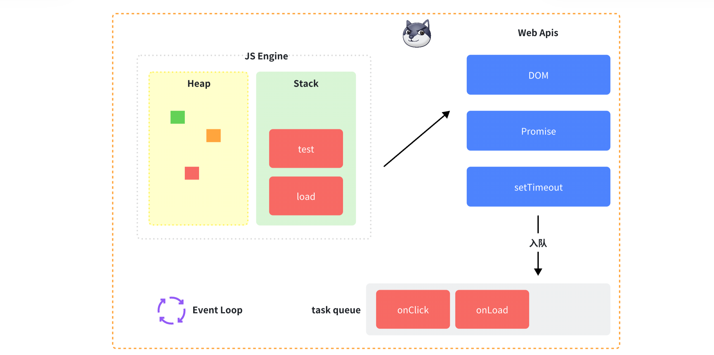
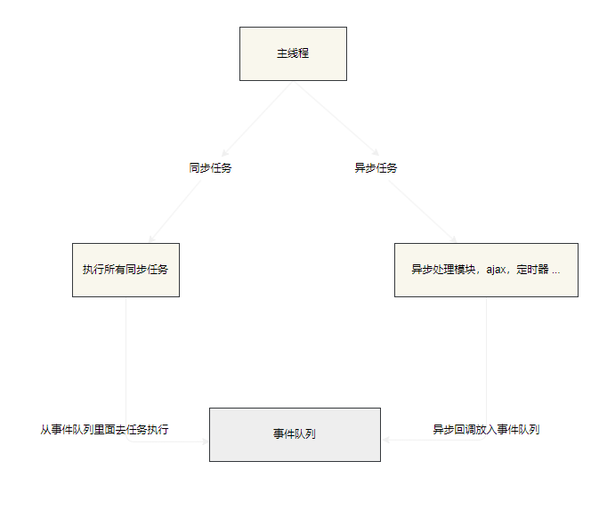

---
sidebar:
  title: 浏览器事件循环
#   step: 95
isTimeLine: true
title: 浏览器事件循环
date: 2024-6-10 16:02:00
tags:
  - 技术笔记
categories:
  - 技术笔记
recommend: 9
---

# 浏览器事件循序

> 由于 JavaScript 是单线程的， 这就意味着 某些时刻它只能执行一个任务。但是为了处理 `异步任务`，（DOM 操作， 计时器的触发，网络请求 等等方式）

事件循环（Event Loop）是 JavaScript 引擎用来处理异步任务的一种机制(工作方式)，主要由主线程和任务队列组成。弥补了 JavaScript 不能并发操作的缺点，使其不需要等待导致 `任务阻塞` 的问题, 去执行其他任务

<!-- JavaScript 是单线程的，但是为了处理异步任务，它使用了事件循环（Event Loop） -->

## 什么是线程，进程，二者有什么区别和联系

- 进程 :是计算机系统资源分配的最小单位，该最小单位相互之间有独立的内存，进程有独立的内存空间；

- 线程 :是计算机 cpu 调度分配的最小单位，调度最小单位是 cpu 中可以独立运行的最小基本单位，线程没有属于自己的内存空间；

- 一个进程可以有很多线程，每条线程并行执行不同的任务。

::: tip 个人理解

把 计算机系统 比如为 一个公司

进程： 公司的每个独立部门， 每个部门有自己的工作资源 基本很少影响到其他部门

线程： 每个独立部门的小员工， 在这个区域内共享当前部门（进程）的资源

:::

## 浏览器进程

> 为了避免相互影响，为了减少连环崩溃的几率，当启动浏览器后，它会自动启动多个进程。

- 浏览器进程

主要负责界⾯显示、⽤户交互、⼦进程管理等。浏览器进程内部会启动多个线程处理不同的任务。

- ⽹络进程

负责加载⽹络资源。⽹络进程内部会启动多个线程来处理不同的⽹络任务。

- 渲染进程

渲染进程启动后，会开启⼀个渲染主线程，主线程负责执⾏ HTML、CSS、JS 代码。

::: tip
默认情况下，浏览器会为每个标签⻚开启⼀个新的渲染进程，以保证不同的标签⻚之间不相互影响

当打开电脑的任务管理器 可以看到浏览器当下有几个标签页， 这个浏览器应用就有几个渲染进程
:::

## 浏览器事件循环



## 何为事件循环

> 事件循环是浏览器渲染主线程的工作方式 ，因为渲染线程只有一个， 当 解析 HTML / CSS / 执⾏全局 JS 代码 / 执⾏计时器的回调函数 / 为了确保主线程不会被阻塞 所以浏览器会开启一个事件循环，将主线程中的任务拆分成多个任务，然后依次执行

1. 在最开始的时候，渲染主线程会进入一个无限循环

2. 在循环的过中， 渲染主线程会检查事件队列，如果有任务，则将任务从队列中取出，并放到执行栈中执行

3. 当有新的任务 或者 其他所有线程 可以 继续添加到事件列队末位

4. 然后一直循序循环，直到队列为空，然后进入下一轮循环

## 异步

在某些场景下 可能会有异步任务没办法立刻处理

- 计时完成后需要执行的任务 —— setTimeout 、 setInterval
- ⽹络通信完成后需要执⾏的任务 -- XHR 、 Fetch
- ⽤户操作后需要执⾏的任务 -- addEventListener

::: warning
因为渲染进程是个很重要的进程，如果一直是同步的方式，那么可能就会导致渲染进程无法执行，从而导致页面卡死， 所以浏览器采用了异步的方式 确保主线程不会被阻塞

大白话： 假设排队吃饭， 如果你要等待朋友一起吃饭，你不可能一直占着前面的队伍硬要等待朋友来一起吃， 这样会影响别人， 所以你可能要离开当前队伍，然后等朋友来了，再回来继续排队

:::

那么异步处理方式 浏览器可能会开启某些进程， 将主线程的异步任务丢到这个 `某些`进程中， 最后再把回调函数在插入事件队列某位

## 事件队列（消息队列）



> 上面说的 事件队列（消息队列） 其实是 各个任务入栈的的循序 （先进先出）

## 任务有优先级吗？

任务没有优先级，在队列中先进先出

<span style="color:red">但队列是有优先级的</span>

::: tip

在目前 chrome 的实现中，至少包含了下面的队列：

1.  微队列：用户存放需要最快执行的任务，优先级「最高」
2.  交互队列：用于存放用户操作后产生的事件处理任务，优先级「高」
3.  延时队列：用于存放计时器到达后的回调任务，优先级「中」
    :::

### 宏（普通）任务

可以将每次执行栈执行的代码当做是一个宏任务

- I/O（Input/Output）
- setTimeout
- setInterval
- setImmediate
- requestAnimationFrame

### 微任务

当 `宏任务` 执行完，会在渲染前，将执行期间所产生的所有微任务都执行完

- process.nextTick
- MutationObserver
- Promise.then catch finally

## 自测

## case 1

```js
console.log(1)

queueMicrotask(() => {
  console.log(2)
})

Promise.resolve().then(() => console.log(3))

setTimeout(() => {
  console.log(4)
})
```

<details>
  <summary><mark><font color=darkred>点击查看答案</font></mark></summary>
  <p> 输出结果</p>
  <pre><code>  
  // 1 2 3 4
  </code></pre>

    执行栈（ECStack）： [1]

    微任务：[console.log(2), console.log(3)]

    宏任务：[console.log(4)]

</details>

## case 2

```js
console.log(1)

setTimeout(() => {
  console.log(2)
  Promise.resolve().then(() => {
    console.log(3)
  })
})

new Promise((resolve, reject) => {
  console.log(4)
  resolve(5)
}).then((data) => {
  console.log(data)
})

setTimeout(() => {
  console.log(6)
})

console.log(7)
```

<details>
  <summary><mark><font color=darkred>点击查看答案</font></mark></summary>
  <p> 输出结果</p>
  <pre><code>  
  // 1 4 7  5 2  3 6
  </code></pre>

    执行栈（ECStack）： [1，console.log(4)， 7]

    微任务：[console.log(data);] // 第一轮没有了 -> 5

    宏任务：[
        console.log(2);
        Promise.resolve().then(() => {
            console.log(3)
        });

        console.log(6);
    ]

    微任务2：[ console.log(3)]

</details>

## case 3

```js
console.log(1)

setTimeout(() => {
  console.log(2)
  Promise.resolve().then(() => {
    console.log(3)
  })
})

new Promise((resolve, reject) => {
  console.log(4)
  resolve(5)
}).then((data) => {
  console.log(data)

  Promise.resolve()
    .then(() => {
      console.log(6)
    })
    .then(() => {
      console.log(7)

      setTimeout(() => {
        console.log(8)
      }, 0)
    })
})

setTimeout(() => {
  console.log(9)
})

console.log(10)
```

<details>
  <summary><mark><font color=darkred>点击查看答案</font></mark></summary>
  <p> 输出结果</p>
  <pre><code>  
    // 1410  567  239 8
  </code></pre>

    执行栈（ECStack）： [console.log(1) ,  console.log(4) , console.log(10)]

    微任务：[
            then((data) => {
                console.log(data); ->5 -> 第一轮的微任务
                Promise.resolve().then(() => {
                    console.log(6) 第一轮的微任务
                }).then(() => {
                    console.log(7) 第一轮的微任务

                    setTimeout(() => {
                    console.log(8)
                    }, 0);
                });
            })
        ]
    宏任务：[
       console.log(2);
        Promise.resolve().then(() => {
            console.log(3) 第二轮的微任务
        });,
        console.log(9);
    ]

    微任务2：[
        Promise.resolve().then(() => {
            console.log(3)
        });,
     ]

</details>

## case 4

```js
console.log(1)

setTimeout(() => console.log(2))

Promise.resolve().then(() => console.log(3))

Promise.resolve().then(() => setTimeout(() => console.log(4)))

Promise.resolve().then(() => console.log(5))

setTimeout(() => console.log(6))

console.log(7)
```

<details>
  <summary><mark><font color=darkred>点击查看答案</font></mark></summary>
  <p> 输出结果</p>
  <pre><code>  
  // 17 35 26 4
  </code></pre>

    执行栈（ECStack）： [1，7]

    微任务：[3， setTimeout(() => console.log(4))， 5]
    宏任务：[
        2
        6
    ]

</details>
