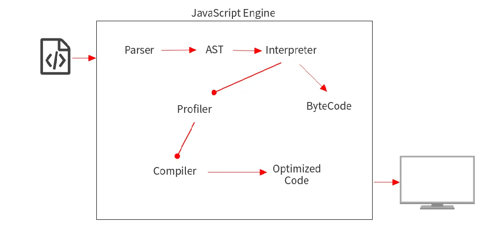

---
sidebar:
  title: 垃圾回收
#   step: 95
isTimeLine: true
title: 垃圾回收
date: 2024-6-10 14:30:56
tags:
  - 技术笔记
categories:
  - 技术笔记
recommend: 8
---

# 垃圾回收

> 垃圾回收，又称为：GC（garbage collection） `GC` 即 `Garbage Collection` ，程序工作过程中会产生很多 垃圾
> 而 `GC` 就是负责回收垃圾的，因为他工作在引擎内部，所以对于我们前端来说，`GC` 过程是相对比较无感的，这一套引擎执行而对我们又相对无感的操作也就是常说的 `垃圾回收机制`

## 解释与编译

JavaScript 代码的解释过程如下：
::: tip
编译相当于做好了一桌子菜，可以直接开吃了。而解释就相当于吃火锅，需要一边煮一边吃。
:::

- 编译型： 编译为字节码文件 -> 执行
  - JAVA C
- 解释型： 边编译，边执行
  - Python JavaScript



- Interpreter 逐行读取代码并立即执行
- Compiler 读取您的整个代码，进行一些优化，然后生成优化后的代码。

## JavaScript 编译器

- v8 引擎
- javaScriptCore 引擎 (Apple)
- SpiderMonkey (Mozilla)

::: tip
谷歌的 Chrome 使用 V8，Safari 使用 JavaScriptCore，Firefox 使用 SpiderMonkey
:::

简单 V8 的处理过程:

1. 始于从网络中获取 JavaScript 代码。
2. V8 解析源代码并将其转化为抽象语法树（AST）。
3. 基于该 AST，Ignition 解释器可以开始做它的事情，并产生字节码。
4. 在这一点上，引擎开始运行代码并收集类型反馈。
5. 为了使它运行得更快，字节码可以和反馈数据一起被发送到优化编译器 TurboFan。优化编译器在此基础上做出某些假设，然后产生高度优化的机器代码。
6. 如果在某些时候，其中一个假设被证明是不正确的，优化编译器就会取消优化，并回到解释器中。

## 垃圾回收

### 1.引用计数法 `（最烂的一个）`

它的策略是跟踪记录每个变量值被使用的次数

- 当声明了一个变量并且将一个引用类型赋值给该变量的时候这个值的引用次数就为 1
- 如果同一个值又被赋给另一个变量，那么引用数加 1
- 如果该变量的值被其他的值覆盖了，则引用次数减 1
- 当这个值的引用次数变为 0 的时候，说明没有变量在使用，这个值没法被访问了，回收空间，垃圾回收器会在运行的时候清理掉引用次数为 0 的值占用的内存

优点

- 简单 目的清晰 0 就是没用引用了可以清除

缺点

- 需要一个计数器，因此计数器需要占用内存，因为我们也不知道被引用数量的上限

```js
function test() {
  let A = new Object();
  let B = new Object();

  A.b = B;
  B.a = A;
}
```

::: warning 弊端
这个算法最怕的就是循环应用，还有比如 JavaScript 中不恰当的闭包写法。
:::

### 2.标记-清除算法

标记清除（Mark-Sweep），目前在 JavaScript 引擎 里这种算法是最常用的

1. 垃圾收集器在运行时会给内存中的所有变量都加上一个标记，假设内存中所有对象都是垃圾，全标记为 0
2. 然后从各个根对象开始遍历，把不是垃圾的节点改成 1
3. 清理所有标记为 0 的垃圾，销毁并回收它们所占用的内存空间
4. 最后，把所有内存中对象标记修改为 0，等待下一轮垃圾回收

::: tip 总结
优点

- 标记清除算法的优点只有一个，那就是实现比较简单，打标记也无非打与不打两种情况，这使得一位二进制位（0 和 1）就可以为其标记，非常简单

缺点

- 就是在清除之后，剩余的对象内存位置是不变的，也会导致空闲内存空间是不连续的，出现了 内存碎片 `就是出现 断层现象 一块块的`
  :::

### 3.标记-整理算法

可以有效地解决，它的标记阶段和标记清除算法没有什么不同，只是标记结束后，标记整理算法会将活着的对象（即不需要清理的对象）向内存的一端移动，最后清理掉边界的内存

## 内存管理

新生代 + 老生代

::: tip :chicken:
V8 的垃圾回收策略主要基于分代式垃圾回收机制，V8 中将堆内存分为新生代和老生代两区域，采用不同的垃圾回收器也就是不同的策略管理垃圾回收
:::

### 1. 新生代

- 新生代分为 空闲空间、使用空间、
- 空闲区的空间占用超过了 25%，那么这个对象会被直接晋升到老生代空间中。25%比例的设置是为了避免影响后续内存分配

### 2. 老生代

不同于新生代，老生代中存储的内容是相对使用频繁并且短时间无需清理回收的内容。这部分我们可以使用`标记整理`进行处理
