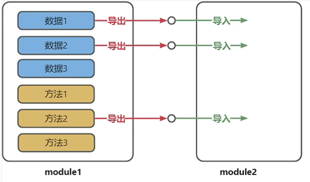
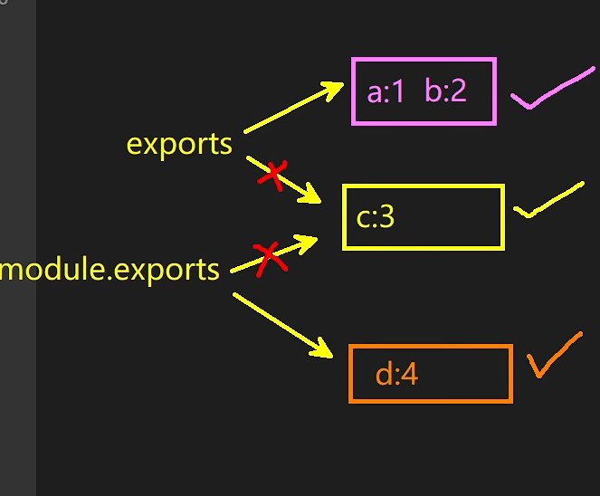

---
sidebar:
  title: JavaScript模块化
#   step: 95
isTimeLine: true
title: JavaScript模块化
tags:
  - 技术笔记
categories:
  - 技术笔记
recommend: 10
---

# JavaScript 模块化

- 将程序文件依据一定的规则 `拆分` 成多个文件
- 拆分出来 `每个文件就是一个模块`， 模块中的数据都是`私有的`， 模块之间互相隔离
- 同时也可以通过一些手段，可以把模块内的指定数据 `交出求`， 供其他模块适用

## 1. 为什么需要模块

随着应用的复杂度越来越高，其代码量和文件数量都持续增加会引发一下问题

1. 全局污染问题

2. 依赖混乱问题

3. 数据安全问题

## 2. 有哪些模块化规范

> 历史背景： 2009 年， 随着 Node.js 的流行， JAVAScript 在服务端的应用逐渐增多，为了让
> Node.js 的 代码更好维护， 制定了一种 Node.js 环境下的模块化规范 也就是 `CommonJS 规范`

随着时间的推移， 针对 JavaScript 的模块化规范，又出现了很多种，如：

::: tip 按时间排序

1. CommonJS 规范
2. AMD 规范
3. CMD 规范
4. ES6 模块化规范

:::

## 3. 导入与导出的概念

> 模块化的核心思想就是： 模块之间是`隔离的` (类似加多了一层保护层)， 通过`导入`和`导出`进行数据和功能的共享

- 导出： 模块公开内容的一部分 （变量， 函数等）， 使这些内容可以被其他模块所使用
- 导入： 模块引入和适用其他模块导出的内容，以重用代码和功能



## 4. CommonJS 规范

> 1. 代码都是在模块内执行，模块化的作用域
> 2. 模块如果多次引用，只会执行一次， 后续内容 缓存
> 3. 同步加载
> 4. 模块的加载顺序是 按照代码的顺序

### 1. 初步体验

```js
// 导出
var x = 5
var addX = function (val) {
  return val + x
}

module.exports = {
  x,
  addX,
}

// 导入
var example = require('./模块xxxx')

console.log(example.addX(1))
console.log(example.x)
```

### 2. 导出数据

> 在 CommonJS 规范中， 模块的导出数据有两种
>
> - `exports` 对象
> - `module.exports` 对象

::: danger 注意点如下

1. 每个模块内部的： this、exports 、module.exports 在初始化时，都指向同一个`对象`

   - this === module.exports == exports

2. 无论如何修改导出对象 最终导出的都是 module.exports 的值

   

```js
exports = { a: 1 }
exports.b = 2
module.exports.c = 3
module.exports = { d: 4 }

// 输出 只有 { d: 4 }
```

3. `exports` 是对 `module.exports` 的初始引用，仅为了方便给导出象添加属性，所以不能使用 `exports = value` 的形式导出数据，但是可以使用 `module.exports = xxxx` 导出数据。

```js
// 在导出情况一致的时候
exports.a = 1 // 肯定它是最优
module.exports.a = 1

// 当冲突的时候， 最终取得值 是 module.exports 的值
```

:::

### 3. 导入数据

```js
var example = require('./模块xxxx')
var example1 = require('./模块xxxx')

// 当如果结构的时候， 遇到 同名的 可以适用 es6 别名的方式
var { name } = require('./模块xxxx')
var { name: name1 } = require('./模块xxxx')
```

### 4. 扩展理解

- 一个个 JS 模块在执行时，是被包裹在一个内置函数中执行的，所以每个模块都有自己的作用域，我们可以通过如下方式验证这一说法:

```js
// 源码
var x = 5
var addX = function (val) {
  return val + x
}
exports.x = x
module.exports.c = 3

module.exports = {
  x,
  addX,
}


// 解析后
function (exports, require, module, __filename, __dirname) {
    var x = 5
    var addX = function (val) {
      return val + x
    }
   
    module.exports = {
      x,
      addX,
    }
   
}
 
```

## 5. ES6 模块化 规范

> ES6 模块化规范是一个`官方标准`的规范， 他是在语言标准的层面上实现了模块化功能， 目前浏览器 / Node.js 已经支持了 ES6 模块化规范，（type="module"）

### 1. 初步体验

```js
export const name = 1
```

### 2. Node 中运行 ES6 模块

Node.js 中运行 ES6 模块代码有两种方式：

- 将 JavaScript 文件后缀从.js 改为.mjs，Node 则会自动识别 ES6 模块。

- 在 package.json 中设置 type 属性值为 module

- 在 index.html `<script>` 标签 中设置 type 属性值为 module

### 3.导出数据

ES6 模块化规范中， 模块的导出数据有三种

::: details 分别导出

```js
export const name = 1
export function addX(val) {}
```

:::

::: details 统一导出

```js
const name = 1
function addX(val) {}
export { name, addX }
```

:::

::: details 默认导出

```js
export default function addX(val) {}
function add1() {}
export default { name: 1, add: add1 }
```

:::

### 4.导入数据

ES6 模块化规范中， 使用 import 关键字导入数据， 导入的方式要根据导出方式决定

::: details 导入全部 - 通用

```js
import * as example from './模块xxxx'
```

:::

::: details 命名导入 - [分别导出, 统一导出]

```js
import { xx1 as aliasXX } from './模块xxxx'
```

:::

::: details 默认导入 - [默认导出]

```js
import xxx from './模块xxxx'

// xxx 随便命名 一般情况下 使用 采用文件夹定义的名字
```

:::

::: details 命名导入 与 默认导入 混合

```js
import xxx, { x1, x2, x3 } from './模块xxxx'

// xxx 随便命名 一般情况下 使用 采用文件夹定义的名字
```

:::

### 5. 数据引用问题

::: details 如下代码的输出结果是什么

```js
function count() {
  let sum = 1
  function add() {
    sum += 1
  }
  return { sum, add }
}

const { sum, add } = count()

console.log(sum) // 1
add()
add()
console.log(sum) // 1
```

:::

::: details 使用 CommonJS 规范，编写如下代码

```js
let sum = 1

function add() {
  sum += 1
}

module.exports = { sum, add }

const { sum, add } = require('./xxxx.js')

console.log(sum) // 1
add()
add()
console.log(sum) // 1
```

:::

::: details 使用 ES6 规范，编写如下代码

```js
let sum = 1

function add() {
  sum += 1
}

exports { sum, add }


import { sum, add } from './count.js'

console.log(sum) // 1
add()
add()
console.log(sum) // 3
```

:::

## 6. ESM 与 CommonJS 总结

1. ES6 模块输出的是值的引用 CommonJS 模块输出的是值的拷贝

::: info :skateboard:

在 上面 `5. 数据引用问题`

:::

2. ES6 模块是编译时输出接口 CommonJS 模块是运行时加载，

::: info :skateboard:

- CommonJS 加载的是一个对象 （即`module.exports`属性），该对象只有在脚本运行完才会生成
- ES6 模块不是对象，它的对外接口只是一种静态定义，在代码静态解析阶段就会生成

```js
import { count } from './counter.js' // ok
import {count} from `${pathname}.js` // error

const pathname = './counter.js'
require(`${pathname}.js`) // ok

```

:::

3. ES6 模块的 `import` 命令是异步加载 CommonJS 模块的 `require()`是同步加载模块

4. 两者循环引用问题

::: details CommonJS 循环引用

```js
// a.js 模块
exports.done = false
var b = require('./b.js')
console.log('在 a.js 之中，b.done = %j', b.done)
exports.done = true
console.log('a.js 执行完毕')

上面代码之中，a.js脚本先输出一个done变量，然后加载另一个脚本文件b.js。
注意，此时a.js代码就停在这里，等待b.js执行完毕，再往下执行。


// b.js 模块
exports.done = false;
var a = require('./a.js');
console.log('在 b.js 之中，a.done = %j', a.done);
exports.done = true;
console.log('b.js 执行完毕');


// main.js 模块
var a = require('./a.js');
var b = require('./b.js');
console.log('在 main.js 之中, a.done=%j, b.done=%j', a.done, b.done);


// 在 b.js 之中，a.done = false
// b.js 执行完毕
// 在 a.js 之中，b.done = true
// a.js 执行完毕
// 在 main.js 之中, a.done=true, b.done=true


```

:::

::: details ESM 循环引用

```js

```

:::

## 7. AMD (了解)

```js
// js/main.js

(function () {
  require.config({
    baseUrl: 'js/', //基本路径 出发点在根目录下
    paths: {
      //映射: 模块标识名: 路径
      alerter: './modules/alerter', //此处不能写成alerter.js,会报错
      dataService: './modules/dataService',
    },
  })
  require(['alerter'], function (alerter) {
    alerter.showMsg()
  })
})()

// 使用 require.js 包 https://github.com/requirejs/requirejs
<script data-main="js/main" src="js/libs/require.js"></script>

```

## 8. CMD (了解)

```js
// 使用sea.js  https://seajs.github.io/seajs/docs/


define(function (require, exports, module) {
  // 同步代码
  var module2 = require('./module2')

  function show() {
    console.log('module4 show', module2.msg)
  }

  exports.show = show

  // 异步模块
  require.async('./module3.js', function (m3) {
    console.log('async m3', m3.API_KEY)
  })
})


<script src="./js/lib/sea.js"></script>

<script>
    seajs.use('./js/modules/main.js')
</script>
```
