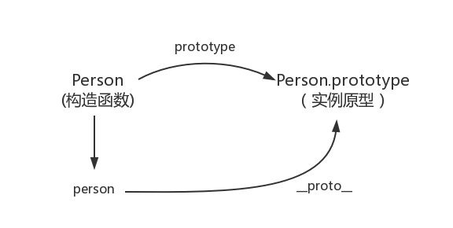

---
sidebar:
  title: 原型&原型链
#   step: 100
isTimeLine: true
title: 原型&原型链
date: 2024-06-09
tags:
  - 技术笔记

categories:
  - 技术笔记
recommend: 2
---

## 原型&原型链

::: tip
原型(prototype):
任何一个 js 对象（除 null）中创建时会关联一个对象
任何根据原型的构造函数创建出来的对象都会共享原型中的属性和方法
:::

### 1. 构造函数创建对象

```js
function Person() {}
var person = new Person();
person.name = "张三";
console.log(person.name); // 张三

// Person 就是一个构造函数，我们使用 new 创建了一个实例对象 person
```

### 2. prototype

每个函数都有一个 prototype 属性 比如：

```js
function Person() {}

// prototype是函数才会有的属性
Person.prototype.name = "张三";

var person1 = new Person();
var person2 = new Person();

console.log(person1.name); // 张三
console.log(person2.name); // 张三
```

用一张图表示构造函数和实例原型之间的关系


### 3. `__proto__`

这是每一个 JavaScript 对象(除了 null )都具有的一个属性，叫 `__proto__` ，这个属性会指向该对象的原型。

```js
function Person() {}
var person = new Person();

console.log(person.__proto__ === Person.prototype); // true
```



### 4. constructor

```js
function Person() {}

console.log(Person.prototype.constructor === Person); // true
```


```js
function Person() {}

var person = new Person();

console.log(person.__proto__ == Person.prototype); // true

console.log(Person.prototype.constructor == Person); // true

console.log(Object.getPrototypeOf(person) === Person.prototype); // true
```

### 5. 原型的原型

如果在原型上还没有找到呢？原型的原型又是什么呢？


### 6. 原型链


