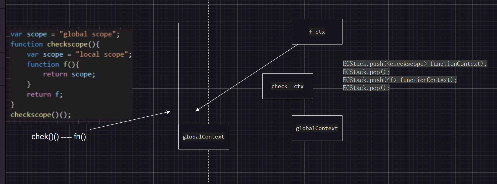

---
sidebar:
  title: 执行上下文
#   step: 98
isTimeLine: true
title: 执行上下文
date: 2024-06-09
tags:
  - 技术笔记

categories:
  - 技术笔记
recommend: 4
---

# 执行上下文

### 1. 顺序执行

```js
var foo = function () {
  console.log("foo1");
};

foo(); // foo1

var foo = function () {
  console.log("foo2");
};

foo(); // foo2
```

```js
function foo() {
  console.log("foo1");
}

foo(); // foo2

function foo() {
  console.log("foo2");
}

foo(); // foo2
```

### 2. 可执行代码

三种 : 全局代码 函数代码 eval 代码

1. 执行上下文 execution context
2. 执行上下文栈 execution context stack -> 先进后出

### 3.执行上下文栈

```js
// 第一步 创建了执行上下文栈（Execution context stack，ECS）来管理执行上下文
ECStack = []

// 第二步 创建全局执行上下文（Global execution context，GEC）
ECStack = [GlobalContext]

// 例子
function fun3() {
  console.log('fun3')
}

function fun2() {
  fun3()
}

function fun1() {
  fun2()
}

fun1()

// 原理
ECStack.push(<fun1> functionContext);
ECStack.push(<fun2> functionContext);
ECStack.push(<fun3> functionContext);
// fun3执行完毕
ECStack.pop();
// fun2执行完毕
ECStack.pop();
// fun1执行完毕
ECStack.pop();

```

### 4. 回顾上文 所说的两段代码执行区别

case 1

```js
var scope = "global scope";
function checkscope() {
  var scope = "local scope";
  function f() {
    return scope;
  }
  return f();
}
checkscope();
```


case 2

```js
var scope = "global scope";
function checkscope() {
  var scope = "local scope";
  function f() {
    return scope;
  }
  return f;
}
checkscope()();
```


